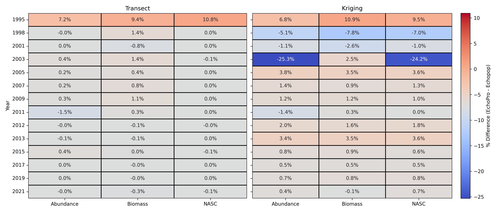

(comparison_results)=

# Cross-year comparisons

The figure below summarizes the signed percent differences in total abundance, biomass, and $S_\text{A}$ between EchoPro and Echopop across all survey years, for both the transect and kriged population estimates. Each cell represents:

$$
    \text{\% Difference} = \frac{ \text{X}_\text{Echopop} - \text{X}_\text{EchoPro} }{ \text{X}_\text{EchoPro} } \times 100,
$$

where $X$ is a specific quantity, such as NASC, biomass density, biomass, etc. In the table, red cells indicate Echopop values exceed EchoPro values, and blue cells indicate the opposite. Cells close to zero (white) indicate strong agreement between the two implementations.

:::{admonition} What do these outputs represent?
:class: note
Importantly, the values shown in the figure above correspond to the outputs of Echopop and EchoPro where the following conditions were enforced:
- **Age-2+ only**
- **Biodata processed using KS strata**
- **Biomass density is the kriged variable, which results in abundance and $S_\text{A}$ both being derived quantities**
- **Kriged estimates were extrapolated over the entire mesh grid**
:::

## Results

### Transect estimates

Agreement between EchoPro and Echopop transect estimates is generally strong across all survey years, with differences becoming increasingly small in more recent surveys.

#### 1995, 2001, 2005 - 2009, 2012 - 2021
Percent differences in abundance, biomass, and $S_\text{A}$ are all below 1.0%, indicating near-identical results between the two implementations for this period. The small observed differences can likely be attributed to the [nuanced changes to how Echopop](#echopro-vs-echopop) computes the number and weight proportions (e.g., unsexed fish are not assumed to be female) compared to EchoPro.

#### 1998, 2003, 2011
Differences remain small but are slightly more variable. In 2011, $S_\text{A}$ and biomass show strong agreement while abundance is marginally elevated at 1.5%. This can be attributed to three hauls (51, 52, 53) being treated as Canadian in the EchoPro biodata, and as American in the dataset Echopop ingests. In the latter, the Canadian haul offset (100) is not added to these particular hauls, so they are not included in the biodata. This is because hauls 151, 152, and 153 are contained within the associated stratification files, **but not** 51, 52, and 53. When these hauls are re-incorporated as Canadian hauls, the difference in abundance (1.5%) and biomass (0.3%) both decrease to values less than 0.1%.

Changes to both the underlying biodata sources, ingestion methods, *and* proportions calculations explain the large percent difference for biomass estimates (~1.4%). The 2003 survey estimates only use the Canadian data. This drastically reduces the sample sizes for the biodata, which can make proportion estimates particularly sensitive to implementation changes.

### Kriged estimates

#### 1995, 2015-2021
Percent differences in kriged abundance, biomass, and $S_\text{A}$ are all below 1.0%, indicating very similar results between the two implementations for this period. The small observed differences can likely be attributed to [changes in how Echopop handles the kriging algorithm compared to EchoPro](#echopro-vs-echopop). Since biomass density was the kriged variable, the percent differences for biomass estimates reflect this implementation difference. The observed deviations in the derived quantities, abundance and $S_\text{A}$, result from compounded changes in both the kriging algorithm and biodata proportion calculations.

#### 2007, 2011

While differences in kriged biomass were less than 1.0% for this period, abundance (2007 and 2011) and $S_\text{A}$ (just 2007) differed by more than 1.0%. This mismatch of agreement-disagreement across quantities is indicative of minor differences in biodata processing and how proportions are calculated. The factors contributing to differences in biomass from 2015 to 2021 can explain those observed in these two years.

#### 1998 - 2003, 2009, 2012,

Biomass, abundance, and $S_\text{A}$ differed by up to 4.0% across these years. It is likely that the updated kriging implementation used by Echopop is the main driver for these observed deviations given the otherwise relatively strong agreement in the transect-based estimates. Given the observed differences in their respective transect-based estimates, it is likely that updated kriging implementation used by Echopop is the primary contributor
