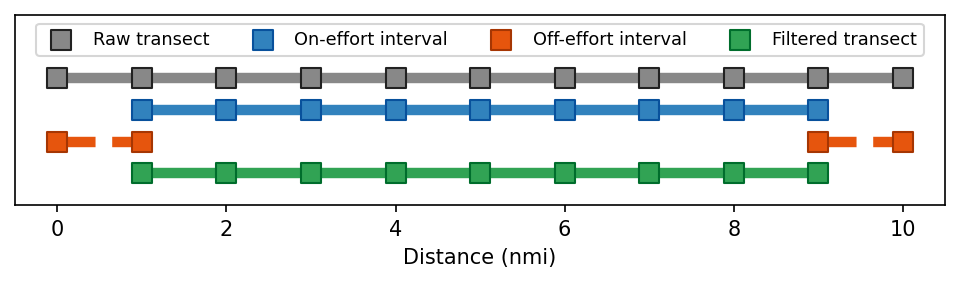
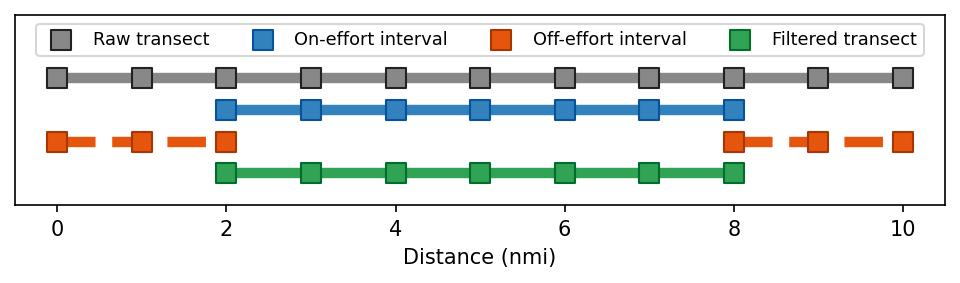
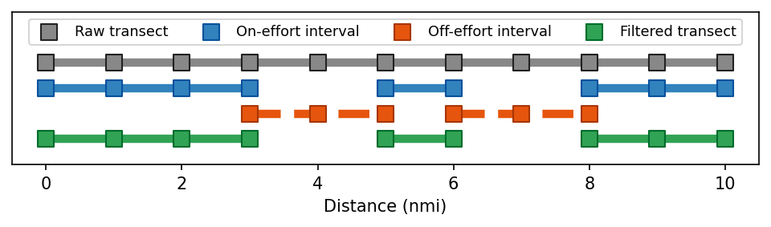

(offeffort-transect-filtering)=
# Filtering off-effort transect intervals

## Removing off-effort intervals from transects

<span style="color:#888888"><b>Raw transect intervals</b></span> from the Echoview exports sometimes require additional filtering to remove off-effort portions (e.g., net hauls, instrument retrieval) that were not completely omitted during processing. Indexing the transect intervals using vessel log distances delineating <span style="color:#3182bd"><b>on-effort intervals</b></span>. The complete set of these intervals can be used as an inclusion filter to effectively remove <span style="color:#e6550d"><b>off-effort intervals</b></span>. The result from this filter yields the final <span style="color:#31a354"><b>filtered transect intervals</b></span> that are used in Echopop. There are three general cases that this filter is applied.

### Transect ends (single intervals)

The simplest case comprises single intervals at the start and end of the transects that are outside the extent of the <span style="color:#3182bd"><b>on-effort intervals</b></span>.



### Transect ends (multiple intervals)

The second case is similar to the first where instead of just one interval at the start and/or end of the transects, there are multiple.



### Along-transect

The third and final cases consists of <span style="color:#e6550d"><b>off-effort intervals</b></span> that occur at one or more points along a transect. 



## Implementation within Echopop

Off-effort transect intervals have to be removed via Echopop for some survey years (e.g. 2011). This can be accomplished using the `filter_transect_intervals` function from the `functions` module. This function has four arguments:

- `nasc_df`: A `pandas.DataFrame` containing the merged and consolidated NASC exports from Echoview. 
- `transect_filter_df`: This argument can either a `pandas.DataFrame` or `pathlib.Path`. 
    - `DataFrame`: There are four required columns: 
        - `transect_num`: Transect number.
        - `log_start`: The starting vessel log distance of teac along-transect interval.
        - `log_end`: The ending vessel log distance of each along-transect interval.
    - `Path`: This is the filepath to a `*.xlsx` and must be accompanied by a sheetname and filter (as explained below).
- `transect_filter_sheet`: An optional argument that is only required when the `transect_filter_df` argument is a `pathlib.Path` object.
- `subset_filter`: An optional argument that uses query strings to subset `transect_filter_df`. When used with a `pathlib.Path` object for `transect_filter_df`, then the read-in must have the column name defined in the string. For instance, a valid input for `subset_filter` could be `"survey == 200316"`, which would remove any rows from the `transect_filter_df` `pandas.DataFrame` whose value for the `survey` column did not equal `200316`. Another valid `subset_filter` could be `"survey == 201103 and transect_num > 100"`, which would not only limit rows to those satisfying `survey == 201103`, but also only apply the filter to rows where `transect_num > 100`.

So calling this function would look like:

```python
from pathlib import Path
from echopop.workflows.nwfsc_feat import functions as feat

# DATA ROOT DIRECTORY
DATA_ROOT = Path("C:/Data/EchopopData/echopop_2011")

# TRANSECT BOUNDARY FILE
TRANSECT_BOUNDARY_FILE = DATA_ROOT / "Kriging_files/Kriging_grid_files/Transect Bounds to 2011.xlsx"
# TRANSECT BOUNDARY SHEET
TRANSECT_BOUNDARY_SHEET = "1995-2011"
# SURVEY FILTER
SURVEY_FILTER = "survey == 201103"

# CALL FUNCTION
df_nasc_filtered = feat.filter_transect_intervals(
    nasc_df=df_nasc, 
    transect_filter_df=TRANSECT_BOUNDARY_FILE,
    transect_filter_sheet=TRANSECT_BOUNDARY_SHEET,
    subset_filter=SURVEY_FILTER
)
```

For this particularly example (i.e., the 2011 survey), the effect of the filtering can be visualized below, where 4140 off-effort intervals were removed from the NASC `pandas.DataFrame`:

<iframe src="../../_static/offeffort_transect_filtering.html" width="700" height="400"></iframe>