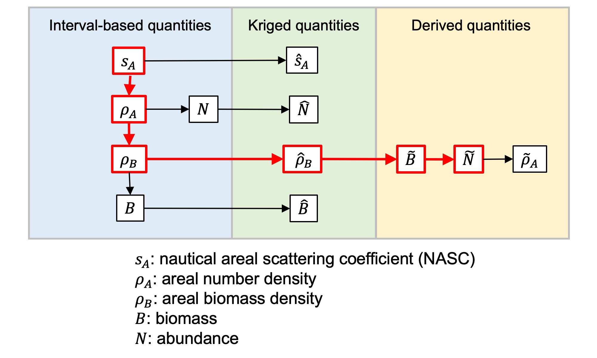

# Overview

## Primary workflow components
The Echopop data workflow consists of 5 primary components. The documentation is organized with roughly the same order to explain each component in detail.

- **Data ingestion**
    - Set up paths
    - Ingest NASC, region, haul data
    - Ingest biological data
    - Load stratification schemes
    - Load kriging parameters
- **Transect interval-based data processing**
    - Stratify ingested data
    - Compute length-weight relationship
    - Compute number proportion
    - Compute weight proportion
- **Biological estimates (transect interval-based)**
    - Compute various biological quantities with following sequence (see [flow diagram](echopop_flow_diagram) below):
        - NASC ($s_A$)
        - abundance ($N$)
        - biomass density $\rho_B$
        - biomass ($B$)
    - Distribute biological estimates across (sex, length, age) for each transect interval
- **Kriging**
    - Coordinate transformation 
    - Variogram analysis and fitting
    - Perform kriging on biomass density: interval-based biomass density ($\rho_B$) → kriged biomass density ($\hat{\rho}_B$)
    - Derive/back-calculate other biological estimates with the following sequence (see [flow diagram](echopop_flow_diagram) below):
        - kriged biomass density ($\tilde{\rho}_B$)
        - kriged biomass ($\tilde{B}$)
        - kriged abundance ($\tilde{N}$)
        - kriged NASC ($\tilde{s}_\text{A}$)
    - Distribute kriged biological estimates across (sex, length, age)
- **Stratified analysis**
    - Perform Jolly-Hampton analysis using transect-based data and kriged data

(echopop_flow_diagram)=
## Data flow diagram
