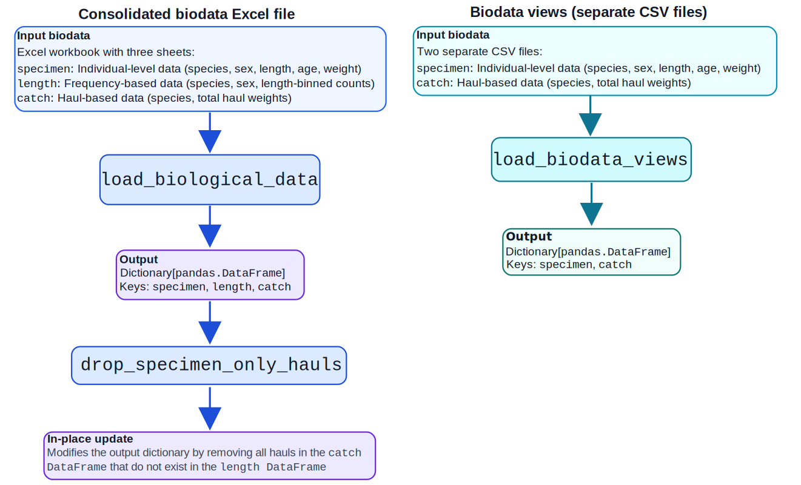
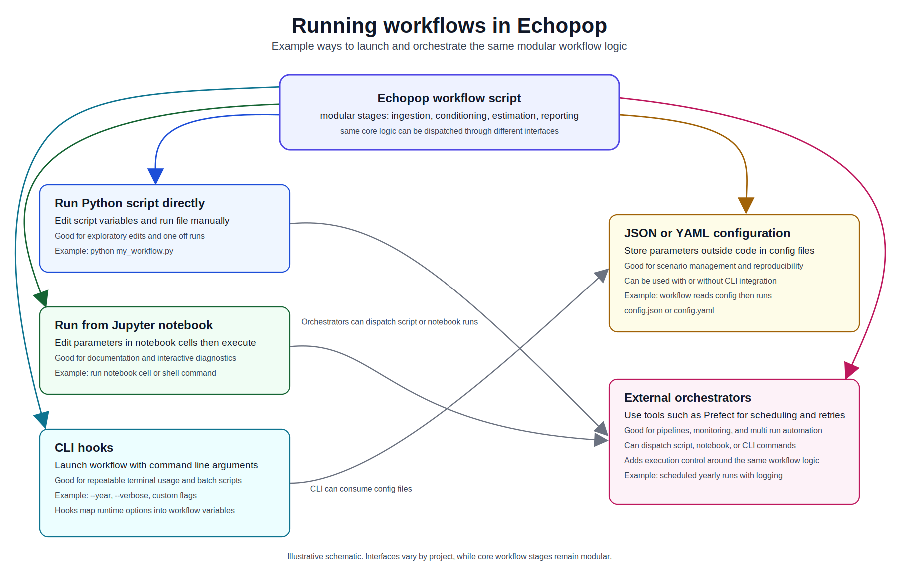

(workflows-overview)=
# Workflows

Echopop is designed to support modular and customizable analyses. A workflow is a reproducible sequence of processing steps that orchestrates ingestion, transformation, estimation, and reporting. This means that two or more scripts can target both the same and different data sources from the same survey while using different configurations and methods to conduct specific analyses. 

Some users may run a complete analysis for one survey year. Other users may run only selected steps for diagnostics, quality control, or data validation.

## Example: ingesting biological data

For example, users may have stored biological data using two different formats: 

### Consolidated Excel file

This is a consolidated Excel file with multiple sheets representing three datasets used in Echopop:

1. `specimen`: Enhanced specimen-specific biometrics including species, sex, length, age, and weight. The unit of observation is each individual fish.
2. `length`: Bulk biometrics that group fish of the same species and sex into length-based bins. The unit of observation is the specific category or group. 
3. `catch`: Haul-based measurements organized by species and total haul weights. The unit of observation is each haul.

These are ingested with {py:func}`load_biological_data <echopop.ingest.load_biological_data>`, which returns a dictionary comprising three keys: `specimen`, `length`, and `catch`. After ingestion, {py:func}`drop_specimen_only_hauls <echopop.workflows.nwfsc_feat.biology.drop_specimen_only_hauls>` is applied in-place so the `catch` `pandas.DataFrame` removes specimen-only hauls that do not appear in the `length` `pandas.DataFrame`.

### Separate CSV files

Separate CSV files produced from an external database can also be used in Echopop that correspond to:

1. `specimen`: All specimen-specific biometrics including species, sex, and length. A subset of animals in this dataset also have age and weight measurements. This is effectively the equivalent of the `specimen` and `length` datasets from the consolidated Excel sheet combined into one where the aggregated length-based counts in the `length` dataset are instead expanded into the original individual length measurements. 
2. `catch`: Haul-based measurements organized by species and total haul weights. The unit of observation is each haul.

These are ingested with {py:func}`load_biodata_views <echopop.ingest.load_biodata_views>`, which returns a dictionary comprising two keys: `specimen` and `catch`. Because there is no `length` dataset in this format, the {py:func}`drop_specimen_only_hauls <echopop.workflows.nwfsc_feat.biology.drop_specimen_only_hauls>` is not called.

## Modularity in practice

Workflows are modular because each stage of a script can be composed, replaced, or extended without redesigning the full analysis. Data ingestion is one example, but the same pattern also applies to preprocessing, filtering, stratification, estimation, diagnostics, plotting, and reporting. The biodata example above illustrates this principle with ingestion choices, but modularity is not limited to ingestion. A user can keep ingestion fixed and still swap other stages such as filtering logic, variogram settings, kriging configuration, report comparison steps, or export behavior.

A useful way to think about workflow design is to treat each script as a sequence of interchangeable stages.

**Input translation** 

Local source files are transformed into Echopop compatible tables and dictionaries.

**Data conditioning**

Rules are applied for exclusions, corrections, joins, and harmonization.

**Analytical configuration**

Script parameters define options for strata, kriging behavior, diagnostics, and runtime controls.

**Estimation and modeling** 

Shared package functions produce standardized population estimates.

**Reporting and comparison**

Outputs are written, visualized, and optionally compared across software or across years.

Because these stages are separable, users can customize any part of a workflow while keeping the remaining stages stable. This supports local flexibility and preserves reproducible scientific processing.

## Running workflows

A workflow can be run in several ways, depending on project needs. Users can run a Python script and edit parameters directly in the file. Users can also run a Jupyter notebook and edit parameters in notebook cells. For command line use, workflows can accept arguments through defined hooks. For stronger reproducibility, runtime settings can be stored in JSON or YAML configuration files and loaded at run time, with or without command line arguments. For larger operational workloads, orchestration tools such as Prefect can schedule, monitor, and retry workflow runs while using the same underlying analysis logic.

These execution options support different operational requirements while preserving the same scientific processing components.

## Read next

For a complete process sequence, see {doc}`overall_workflow`.  
For required source files and formats, see {doc}`input_files`.  
For a from-scratch CLI tutorial, see {doc}`FEAT_notebooks/cli_from_scratch`.  
For JSON and YAML workflow configuration patterns, see {doc}`FEAT_notebooks/workflow_configuration_tutorial`.  
For command line execution of year scripts, see {doc}`FEAT_notebooks/year_specific_workflows`.  
For EchoPro and Echopop comparisons, see {doc}`FEAT_notebooks/cross_year_comparisons`.