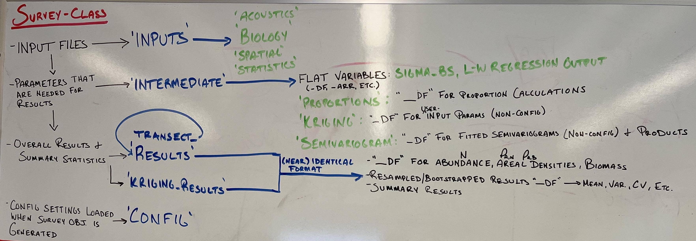

(data-structure)=
# Classes and data structures

The whiteboard image below captures the planned core data structure of the `Survey` object that is central to Echopop. Most of the structure is in place but we will fully implement them very soon (tracked in issue [#169](https://github.com/OSOceanAcoustics/echopop/issues/169)).

