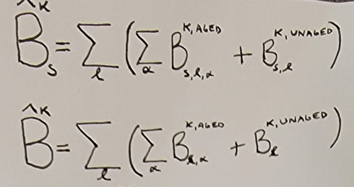
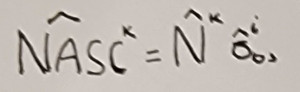
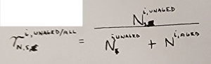
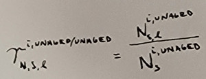
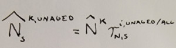
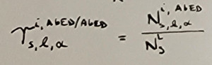
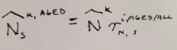
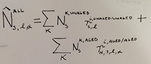

(apportion-abundance)=
# Apportioning kriged abundance



Summed biomass estimates along $\ell$ and $\alpha$ for each $s$ along transect interval $k$ for aged ($B_{s, \ell, \alpha}^{k,\textrm{aged}}$) and unaged ($B_{s, \ell}^{k,\textrm{unaged}}$) kriged biomass estimates are summed together ($\hat{B}_{s}^{k}$) by first summing $B_{s, \ell, \alpha}^{k,\textrm{aged}}$ across $\alpha$ for each $\ell$ and then adding that quantity with $B_{s, \ell}^{k,\textrm{unaged}}$. The result is then summed across all $\ell$ to yield $\hat{B}_{s}^{k}$. This is done in tandem with the unsexed aged ($B_{\ell, \alpha}^{k,\textrm{aged}}$) and unaged ($B_{\ell}^{k,\textrm{unaged}}$) kriged biomass estimates to yield the total biomass ($\hat{B}^{k}$). This not calculated via adding male ($\hat{B}_{M}^{k}$) and female ($\hat{B}_{F}^{k}$) since $\hat{B}^{k}$ is inclusive of male, female, <i>and</i> unsexed fish.

These biomass estimates are then converted to sexed ($\hat{N}_{s}^k$) and total ($\hat{N}^k$) abundance by using averaged length-weight regression output ($\overline{W}^i(\ell)$) for stratum $i$. Consequently, $\overline{W}^i(\ell)$ can be defined either by using the average length-weight relationship produced from each $i$ or parameterizing $\overline{W}^i(\ell)$ with the mean length ($\bar{\ell}^i$) within each $i$. It is important to note, however, that both $\hat{N}_{s}^k$ and $\hat{N}^k$ are calculated using $\overline{W}^i(\ell)$ fit from <b>all</b> individuals (i.e. male, female, and unsexed).


Abundance is then converted to <i>NASC</i> ($\hat{\textit{NASC}}^k$) by multiplying $\hat{N}^k$ by the $i$th averaged linear backscattering cross-section ($\bar{\sigma}_{\textrm{bs}}^i$):



### Unaged fish samples

The relative number proportion ($r_{N}$) for unaged fish for each $s$ ($r_{N,s}^{i, \textrm{unaged/all}}$) represents fraction of each unaged fish $s$ ($N_s^{i, \textrm{unaged}}$) relative to the total counts of both unaged ($N^{i, \textrm{unaged}}$) and aged ($N^{i, \textrm{aged}}$) within each $i$: 

Similarly, the number proportions of unaged specimens for each $s$ distributed across $\ell$ ($r_{N,s,\ell}^{i, \textrm{unaged/unaged}}$) represents the fraction of unaged fish counts within each $\ell$ relative to the total unaged sample count ($N_s^{i, \textrm{ unaged } }$) for each $s$ within each $i$:

The total unaged abundance for each $s$ ($\hat{N}_s^{k,\textrm{unaged}}$) is:

### Aged fish samples

The relative number proportion for aged fish for each $s$ ($r_{N,s}^{i, \textrm{aged/all}}$) represents fraction of each unaged fish $s$ ($N_s^{i, \textrm{aged}}$) relative to both $N^{i, \textrm{unaged}}$ and $N^{i, \textrm{aged}}$ within each $i$: 

Similarly, the number proportions of aged specimens for each $s$ distributed across $\ell$ and $\alpha$ ($r_{N,s,\ell, \alpha}^{i, \textrm{aged/aged}}$) represents the fraction of aged fish counts within each $\ell$ relative to $N_s^{i, \textrm{ aged } }$ for each $s$ within each $i$:

The total aged abundance for each $s$ ($\hat{N}_s^{k,\textrm{aged}}$) is:

### Combining aged and unaged fish abundances

The total abundance ($\hat{N}_{s, \ell, \alpha}^{\textrm{all}}$) from both aged and unaged samples distributed across $\ell$ and $\alpha$ for each $s$ is:

{{ <b> This equation is incorrect and requires tweaking. In the code, what ends up happening is: 
1. A matrix of shape $N_{\ell}$ rows by $N_{\alpha}$ + 1 columns is generated to store both the aged and unaged samples
2. Apportioned unaged $\ell$ abundance is cumulatively updated in that $N_{\alpha}$ + 1 column
3. Apportioned aged $\ell$ and $\alpha$ abundance is cumulatively updated in the preceding $N_{\alpha}$ columns
4. The Matlab code never actually re-apportions the unaged fish abundance over $\alpha$, although it presumably could similar to how unaged biomass is redistributed over $\alpha$
5. Instead, this formula should just be reduced to $\hat{N}_s^{\textrm{all}}$ to represent the summed abundance for each $s$, and then subsequently $\hat{N}^{\textrm{all}}$ for the grand sum
</b> }}

This step involves apportioning the sexed unaged abundance proportion (relative to the total aged and unaged number proportions) over the distribution of $\ell$. This is then summed over $k$. This is similarly done for the sexed aged abundance proportion over the joint distributions of $\ell$ and $\alpha$. 

