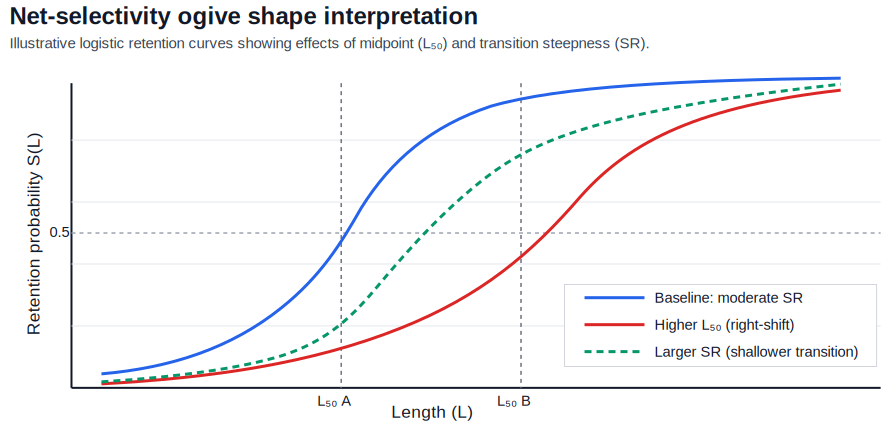
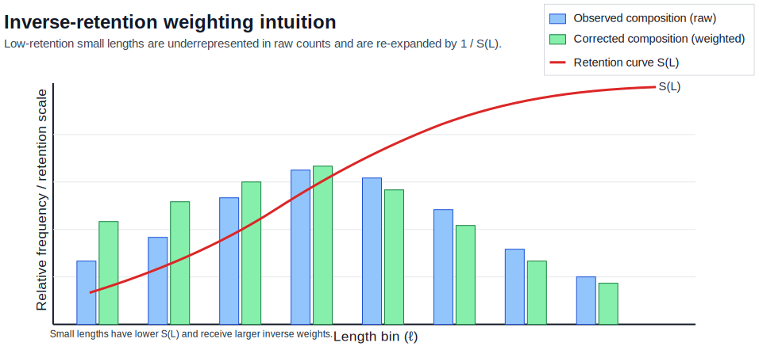

(net-selectivity)=
# Correcting for net-selectivity

This section presents the theoretical basis for length-based net selectivity correction in trawl survey composition data. The objective is to infer latent population composition from observations that are systematically biased by size-dependent retention.

## Gear selectivity
Fishery surveys are subject to **gear selectivity**, where the probability of retention depends on fish morphology, primarily length. In trawl surveys this acts as a length filter: smaller fish are more likely to escape through mesh while larger fish are increasingly retained. The observed composition is therefore not a direct sample of the true population composition.

Let $S(L)$ denote retention probability at length $L$. Then the inverse $\phi(L) = S(L)^{-1}$ provides a first-order expansion that upweights under-retained lengths. Conceptually, this is a Horvitz-Thompson-style adjustment where each sampled specimen contributes in proportion to the inverse of its inclusion probability under the sampling/retention process. When $S(L)$ is correctly specified and sampling within each design cell is otherwise unbiased, inverse-retention weighting yields an unbiased estimator of compositional moments in expectation. In practice, uncertainty in $S(L)$ estimation, finite sample sizes, and sparse tail support require careful stabilization and interpretation {cite:p}`wileman_1996`.

---

## The logistic selectivity model

The standard retention model is a logistic selective ogive. This model is often uses because it mirrors the cumulative probability of two distinct processes:

1. **Physical encounter**: the probability a fish of length $L$ physically contacts the gear.
2. **Retention event**: the probability that once inside the net, the fish is unable to pass through the mesh.

In effect, the model captures the transition from **complete escapement** (very small fish) to **complete retention** (very large fish) {cite:p}`millar_1999`. This selectivity is modeled by:

$$
    S(L) = \left[1 + \exp\left(\frac{2\ln(3)(L_{50} - L)}{SR}\right)\right]^{-1},
    \tag{2.31}
$$

where $L_{50}$ is the length at 50% retention and $SR$ is the selection range ($L_{75} - L_{25}$). This parameterization is biologically interpretable and is the default form in many selectivity analyses because it directly encodes the midpoint and steepness of the retention transition.

### Equivalent regression form

The same model can be written in slope-intercept form:

$$
    S(L) = \frac{1}{1 + \exp\left(-\left(\alpha + \beta L\right)\right)},
    \tag{2.32}
$$

where $\alpha$ is the intercept and $\beta$ is the slope. Applying the logit transform gives:

$$
	\ln\left( \frac{S(L)}{1 - S(L)} \right) = \alpha + \beta L,
	\tag{2.33}
$$

with conversions

$$
    L_{50} = -\frac{\alpha}{\beta},
    \qquad
    SR = \frac{2\ln(3)}{\beta}.
    \tag{2.34}
$$

This equivalence is useful because experimental selectivity studies often report one parameterization while stock-assessment or survey workflows may prefer the other. The model also admits straightforward uncertainty propagation via either coefficient covariance $(\alpha, ~\beta)$ or transformed uncertainty in $(L_{50}, ~SR)$. From a biological perspective, larger $L_{50}$ shifts selectivity rightward (smaller fish less retained), while larger $\beta$ (or smaller $SR$) produces a sharper transition from low to high retention. These shape properties govern how strongly inverse weighting amplifies contributions in the lower-length tail.

**Figure 2.1.** (Conceptual) The parameter $L_{50}$ controls horizontal location while $SR$ (or equivalently $\beta$) controls transition steepness. Both jointly determine the leverage of the inverse-retention correction at small lengths.

## Specimen-level expansion

For each specimen index $j$ with length $L_j$, the stabilized selectivity is defined by:

$$
    S_{\text{eff}}(L_j) = \max\left(S(L_j), ~S_{\min}\right).
    \tag{2.35}
$$

The selectivity expansion factor is therefore defined as:

(specimen-level-expansion-eq)=
$$
    \phi_j = \frac{1}{S_{\text{eff}}(L_j)}.
    \tag{2.36}
$$

The floor $S_{\min}$ prevents numerical explosion when selectivity is extremely small in the left tail.

This stabilization has a clear bias-variance interpretation. Without a floor, bins with very low retention can receive extreme weights that dominate estimates and inflate variance. Introducing $S_{\min}$ truncates that instability, reducing variance at the cost of small bias in regions where true retention is near zero. The choice of $S_{\min}$ is therefore a regularization decision and should be interpreted as a numerical prior against unbounded tail expansion.

## Corrected count and number proportions

Let each specimen belong to a multidimensional bin $g = (i,\ell,\alpha,s,t)$, where $i$ is stratum, $\ell$ is length bin, $\alpha$ is age bin, $s$ is sex, and $t$ is haul. Haul is included since different net-types can comprise different selectivity parameters. The selectivity-corrected counts:

$$
    C_g^{\star} = \sum_{j \in g} \phi_j.
    \tag{2.37}
$$

When biological data are stratified, these haul-level counts are collapsed over haul within each stratum:

$$
    C_{i,\ell,\alpha,s}^{\star} = \sum_{t} C_{i,\ell,\alpha,s,t}^{\star}.
    \tag{2.38}
$$

Number proportions are then normalized within each stratum:

$$
    \tilde{L}^{i\star}_{s,\ell,\alpha} =
        \frac{L_{i,\ell,\alpha,s}^{\star}}{\sum\limits_{s,\ell,\alpha} L_{i,\ell,\alpha,s}^{\star}},
    \qquad
    \sum_{s,\ell,\alpha} \tilde{L}^{i\star}_{s,\ell,\alpha}=1.
    \tag{2.39}
$$

Equations (2.37) to (2.39) define a corrected empirical measure over $(s,\ell,\alpha)$ within stratum $i$. Relative to uncorrected proportions, the reweighting increases the influence of under-retained lengths and decreases the relative dominance of highly retained lengths. The resulting distribution is interpretable as an estimate of the latent population composition conditional on the selectivity model.

An important implication is that correction can alter both marginal and conditional structure: length marginals shift directly through $\phi_j$, and age/sex conditionals may shift indirectly if age/sex composition varies with length.

**Figure 2.2**. (Conceptual) Length bins with low retention probability are underrepresented in raw observations and are re-expanded after inverse-retention weighting, yielding an estimate of latent composition under the assumed selectivity model.

## Corrected weight proportions from fitted length weights

The corrected number composition $\tilde{L}^{i\star}_{s,\ell,\alpha}$ is converted to corrected mass composition using the **sex-specific mean fitted length-binned weight**, $\overline{\mathcal{W}}_{s,\ell}$. Let $\overline{\mathcal{W}}_{s,\ell}$ be:

$$
    \overline{\mathcal{W}}_{s,\ell} =
        \mathbb{E}\!\left[\mathcal{W}_s(L)\mid L\in \mathcal{L}_\ell\right],
    \tag{2.40}
$$

where $\mathcal{W}_s(L)$ is the fitted weight-at-length function ({ref}`Eq. 2.7 <eq-27>`) and $\mathcal{L}_\ell$ is the $\ell$-th length bin. Thus, the weight term is a model-based bin mean, not a raw empirical specimen weight.

Given $\tilde{L}^{i\star}_{s,\ell,\alpha}$ and $\overline{\mathcal{W}}_{s,\ell}$, the unnormalized corrected mass array on the full support $(s,\ell,\alpha)$ is:

$$
    Q^{i\star}_{s,\ell,\alpha} =
        \tilde{L}^{i\star}_{s,\ell,\alpha}\,\overline{\mathcal{W}}_{s,\ell}.
    \tag{2.41}
$$

These can be normalized within stratum $i$ to obtain corrected weight proportions ({ref}`Eq. 2.12 <eq-212>`):

$$
    \tilde{w}^{i\star}_{s,\ell,\alpha} =
        \frac{Q^{i\star}_{s,\ell,\alpha}}
        {\sum\limits_{s,\ell,\alpha}Q^{i\star}_{s,\ell,\alpha}},
    \qquad
    \sum_{s,\ell,\alpha}\tilde{w}^{i\star}_{s,\ell,\alpha}=1.
    \tag{2.42}
$$

This can also be expressed in vector notation for fixed stratum $i$

$$
    \mathcal{J}_i=\{(s,\ell,\alpha)\},
    \qquad
    n_i=\lvert\mathcal{J}_i\rvert,
    \tag{2.43}
$$

where $n_i$ is the vector length.

The same construction can be written in vector form for compactness. For each stratum $i$, the corrected number composition can be represented as a finite-dimensional vector indexed by the cell set:

$$
    \tilde{\mathbf{L}}^{\,i\star} =
        \left(\tilde{L}^{i\star}_{s,\ell,\alpha}\right)_{(s,\ell,\alpha)\in\mathcal{J}_i} \in\mathbb{R}^{n_i},
    \qquad
    \mathcal{J}_i=\{(s,\ell,\alpha)\},
    \qquad
    n_i=\lvert\mathcal{J}_i\rvert,
    \tag{2.44}
$$

where $\mathcal{J}_i$ is the set of valid $s$-$\alpha$-$\ell$ cells in stratum $i$ and $n_i$ is the number of those cells.

The fitted-weight vector and unnormalized mass vector over the same cell set are defined by:

$$
    \overline{\mathbf{W}} =
        \left(\overline{\mathcal{W}}_{s,\ell}\right)_{(s,\ell,\alpha)\in\mathcal{J}_i},
    \qquad
    \mathbf{q}^{\,i} =
        \left(Q^{i\star}_{s,\ell,\alpha}\right)_{(s,\ell,\alpha)\in\mathcal{J}_i}.
$$

The vector mapping from corrected number composition to corrected mass composition, and the subsequent normalization, can therefore be expressed as:

$$
    \mathbf{q}^{\,i} =
        \tilde{\mathbf{L}}^{\,i\star}\odot\overline{\mathbf{W}},
    \qquad
    \tilde{\mathbf{w}}^{\,i\star} =
        \frac{\mathbf{q}^{\,i}}{\mathbf{1}^{\mathsf T}\mathbf{q}^{\,i}}.
    \tag{2.43}
$$

where $\odot$ denotes elementwise multiplication and $\mathbf{1}^{\mathsf T}\mathbf{q}^{\,i}=\sum_{(s,\ell,\alpha)\in\mathcal{J}_i}Q^{i\star}_{s,\ell,\alpha}$. This formulation makes the decomposition explicit: selectivity correction determines corrected relative frequency, while fitted sex-specific mean length-binned weight determines the number-to-mass translation.

:::{admonition} Length-only selectivity
:class: note
The approach assumes the sex-specific fitted mean length-binned weights $\overline{\mathcal{W}}_{s,\ell}$ are representative for all age classes within each $(s,\ell)$ cell. Age effects enter through the corrected number composition $\tilde{L}^{i\star}_{s,\ell,\alpha}$, while the number-to-mass mapping itself is age-invariant conditional on sex and length. If residual age-specific weight differences exist within fixed $(s,\ell)$ bins, corrected biomass proportions inherit that misspecification, especially in sparse bins.
:::

## Assumptions and limitations

Selectivity correction is only as valid as the retention model and its parameter support. Several identifiability and transportability issues should be considered:

- **Model identifiability**: Distinguishing true low abundance at small lengths from poor retention requires informative selectivity data; composition data alone are often insufficient.
- **Parameter transportability**: Ogive parameters estimated in one context (gear rigging, tow speed, mesh condition, vessel behavior, species mix) may not transfer perfectly to another.
- **Tail leverage**: Low-retention regions have high influence under inverse weighting; diagnostics should explicitly evaluate sensitivity to tail behavior and stabilization choices.
- **Design interaction**: Spatial and temporal sampling design can interact with size structure; if selectivity differs by operating context, a single global ogive may be misspecified.

Because of these factors, corrected compositions are best treated as model-based estimates rather than direct observations, and uncertainty communication should include both sampling variability and selectivity-parameter uncertainty. This correction framework relies on several assumptions:

- Selectivity is a function of length only (age/sex effects are mediated through length).
- Parameter values are representative of gear performance during the sampled period.
- Retention and encounter processes are separable (correction targets retention, not availability).
- Zero-count bins remain zero under purely design-based reweighting unless additional modeling is introduced.
- Stabilization via $S_{\min}$ reduces numeric instability but does not eliminate structural uncertainty in poorly observed tails.

These assumptions should be evaluated against survey design, mesh configuration, and any known changes in gear deployment or operation.

## Footnotes

[^1]: Wileman, D. A., Ferro, R. S. T., Fonteyne, R., & Millar, R. B. (Eds.). (1996). *Manual of methods of measuring the selectivity of towed fishing gears*. ICES Cooperative Research Report No. 215.
[^2]: Millar, R. B., & Fryer, R. J. (1999). *Estimating the size-selection curves of towed selection, snapshot, and multi-mesh pelagic sampling gears*. Reviews in Fish Biology and Fisheries, 9(1), 89-116.
